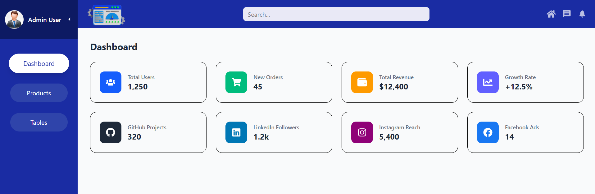
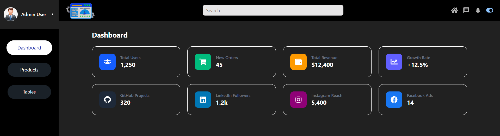

# 🚀 React Admin Dashboard (v2.0 - Theme & Context Evolution)

This is a modern, modular **Admin Dashboard** built with React. It serves as a showcase of my frontend engineering skills, focusing on clean code architecture, global state management, and scalable project structure.

---

## 📸 Screenshots

<div class="flex justify-center gap-4">
  
  
</div>

### 🌙 Dark Mode
<div class="flex justify-center gap-4">
  
</div>

---

## ✨ Key Features & Implementation

### 🌗 Theme Management & Automation (Latest Update)
- **Global Context API:** Integrated `ThemeContext` to manage application-wide state (Light/Dark mode) effectively, eliminating prop drilling.
- **Tailwind CSS v4 Integration:** Utilized the latest `@variant dark` logic combined with a root-level class toggle for high-performance theme switching.
- **State Persistence:** User's theme preference is automatically synchronized with `localStorage` for a consistent experience across sessions.

### 🛡️ Secure Authentication & Routing
- **Protected Routes:** Implemented a `ProtectedRoute` wrapper to manage session-based access control.
- **Session-Based Protection:** Transitioned to sessionStorage to ensure that authentication states are wiped automatically when the browser tab is closed.
- **Persistence:** Uses `localStorage` to maintain authentication states and `React Router DOM` for fluid navigation.
- **Environment Safety:** Sensitive credentials and configurations are managed via `.env` variables using Vite's `import.meta.env`.

### 🏗️ Architecture & Developer Experience (DX)
- **Path Aliasing:** Configured custom aliases (e.g., `@context/*`, `@views/*`) in `vite.config.js` for cleaner imports.
- **Component-Based UI:** Modularized the layout into `Sidebar`, `Navbar`, `Footer` and `Main Content` (using `<Outlet />`) for maximum reusability.
- **Dynamic Configuration:** Sidebar and Navbar elements are rendered dynamically from reusable configuration objects.

---

## 🛠️ Technologies Used

- **Core:** React 18 (Hooks, Context API)
- **Styling:** Tailwind CSS (v4 features utilized)
- **Routing:** React Router DOM v6
- **Build Tool:** Vite
- **Icons:** React Icons (Fa, Md, Io)

---

## 🔑 Demo Access

To test the dashboard functionality, use the following credentials on the login page:

- **Username:** `admin`
- **Password:** `admin_123`

---

## ⚙️ Getting Started

1. **Clone the repository:**
   ```bash
   git clone https://github.com/N-Emil/Admin-Dashboard.git